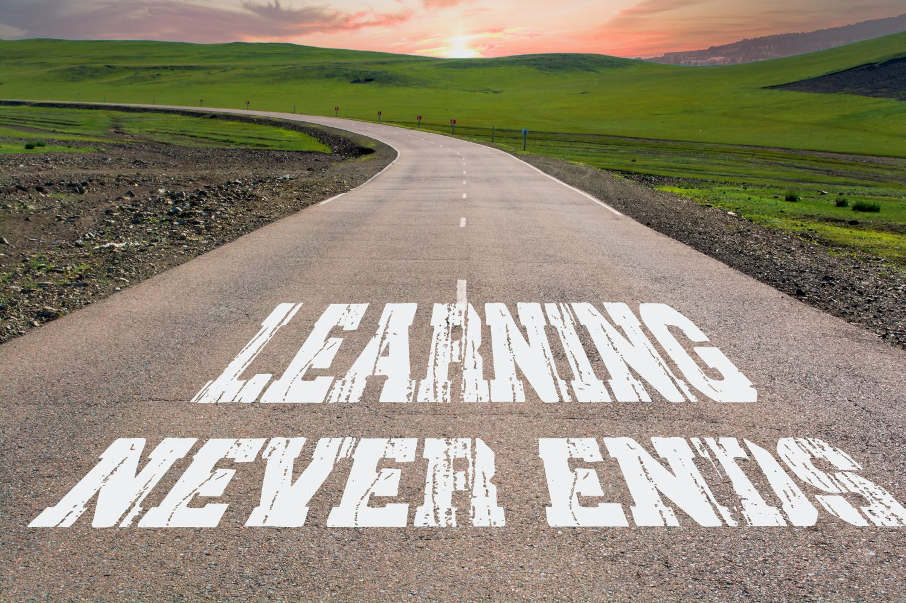

# Greetings to the visitor 😇,

I am a coding enthusiast who loves learning and building. My journey is long, with much to improve, but I believe in steady progress. Each day, I take a step forward, refining my skills and learning from challenges. With consistency and effort, I aim to improve as a developer, one project at a time.

## What I build
- 💪 FrontEnd projects to improve my skills.
- 🧠 Challenges from FrontEnd Mentor to sharpen problem-solving.
- 🔎 Small practice projects to learn and experiment with new concepts.

## A Closing thought
Every project is a chance to grow💡, and I aim to keep improving step by step. If you're also learning, let's build and learn together!🤝
